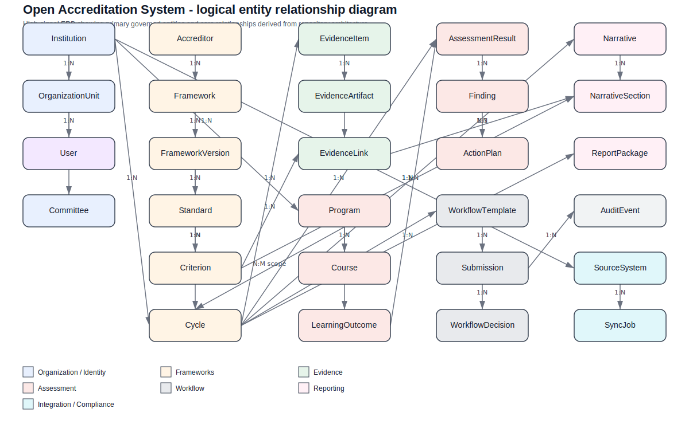

# Entity Model Reference

This document is the canonical logical data model baseline for the Open Accreditation System. It translates the architecture guardrails in `README.md`, `docs/architecture/README.md`, and `docs/architecture/03-bounded-contexts.md` into implementation-oriented entities, relationships, and ownership rules that future modules and AI-assisted implementation prompts should follow.

This is a **logical data model**, not a finalized physical database schema. It is intentionally:

- **domain-centered** for a modular monolith core
- **accreditor-agnostic** across AACSB, ABET, HLC, and future frameworks
- **integration-safe**, keeping source payload details outside core entities
- **AI-assistive but human-governed**, especially for evidence, workflow, narrative, and decision records

## Modeling conventions

### Identifier and type conventions

Unless a module has a stronger reason to do otherwise, prefer these platform-wide conventions:

- `uuid`: primary identifiers for governed records
- `text`: human-readable names, titles, summaries, codes, and external display identifiers
- `enum`: constrained statuses, decision types, role types, and classification values
- `boolean`: policy flags and state markers
- `date`: cycle boundaries, term dates, milestone due dates, and effective windows without time-of-day significance
- `timestamptz`: auditable event, review, approval, submission, and synchronization timestamps
- `jsonb`: controlled extension points for accreditor-specific rule metadata or integration-safe annotations
- `integer`: sequencing, ordering, version counters, retry counts, and durations
- `numeric`: measured values, percentages, scores, and benchmark thresholds when precision matters

### Cross-cutting modeling rules

- Every governed entity should include `id`, `createdAt`, and `updatedAt`.
- Aggregate roots should carry lifecycle state explicitly; child entities should not redefine lifecycle rules owned by the root.
- `Person` is the canonical human concept in the core model. `User` is the authenticated platform identity projection for a person who can sign in.
- Core business meaning stays in bounded contexts; source-system identifiers and raw payloads stay in `SourceSystem`, `IntegrationMapping`, and `SyncJob`.
- Evidence records store metadata and lineage in the core model; binary content remains in object/document storage.
- AI-generated drafts, extraction results, or recommendations are advisory artifacts and never replace human review, workflow approval, or commission decisions.

## Diagram artifacts

- Image: `docs/architecture/diagrams/open-accreditation-entity-relationship.svg`
- Structured graph exchange: `docs/architecture/diagrams/open-accreditation-entity-relationship.graphml`
- AI coding context: `docs/architecture/data-model/entities.ai-context.json`

## Coverage summary by bounded context

| Context | Aggregate roots | Primary supporting entities |
| --- | --- | --- |
| `identity-access` | `User`, `Role`, `ServicePrincipal` | `Permission`, `RolePermissionGrant`, `UserRoleAssignment` |
| `organization-registry` | `Institution`, `Person`, `OrganizationUnit`, `Committee` | none beyond hierarchy/self-references in this phase |
| `accreditation-frameworks` | `Accreditor`, `AccreditationFramework`, `FrameworkVersion`, `AccreditationCycle`, `ReviewTeam` | `Standard`, `Criterion`, `CriterionElement`, `EvidenceRequirement`, `AccreditationScope`, `AccreditationScopeProgram`, `AccreditationScopeOrganizationUnit`, `CycleMilestone`, `ReviewEvent`, `DecisionRecord`, `ReviewerProfile`, `ReviewTeamMembership` |
| `evidence-management` | `EvidenceItem`, `EvidenceCollection`, `EvidenceRequest`, `EvidenceRetentionPolicy` | `EvidenceArtifact`, `EvidenceReference`, `EvidenceReview` |
| `curriculum-mapping` | `Program`, `Course`, `CourseSection`, `AcademicTerm`, `LearningOutcome`, `Competency` | `ProgramOutcomeMap`, `CourseOutcomeMap`, `StandardsAlignment` |
| `assessment-improvement` | `AssessmentPlan`, `AssessmentMeasure`, `AssessmentInstrument`, `BenchmarkTarget`, `AssessmentResult`, `Finding`, `ActionPlan` | `ActionPlanTask`, `ImprovementClosureReview` |
| `workflow-approvals` | `WorkflowTemplate`, `Submission` | `WorkflowStep`, `WorkflowAssignment`, `WorkflowDecision`, `WorkflowComment`, `WorkflowDelegation`, `WorkflowEscalationEvent`, `SubmissionSnapshot`, `SubmissionPackageItem` |
| `narratives-reporting` | `Narrative`, `ReportPackage`, `ExportJob` | `NarrativeSection` |
| `faculty-intelligence` | `FacultyProfile`, `FacultyQualification` | `FacultyAppointment`, `FacultyDeployment`, `FacultyActivity`, `QualificationBasis`, `QualificationReview` |
| `compliance-audit` | `AuditEvent`, `ControlAttestation`, `PolicyException` | none in this phase |
| supporting boundary | `SourceSystem`, `IntegrationMapping`, `SyncJob`, `Notification`, `AIArtifact` | none in this phase |

## Bounded-context entity baseline

### `identity-access`

**Purpose**

Own authentication-facing identities, role definitions, scoped assignments, and permission evaluation inputs without becoming the system of record for all people data.

**Aggregate roots**

- `User`
- `Role`
- `ServicePrincipal`

**Owned entities**

- `Permission`
- `RolePermissionGrant`
- `UserRoleAssignment`

**Key invariants**

- A `User` references exactly one `Person`; a person may exist without a user account.
- `externalSubjectId` is unique per institution and identity provider boundary.
- `UserRoleAssignment` is time-bounded and may be scoped to an `OrganizationUnit`, `Committee`, `AccreditationCycle`, or `ReviewTeam` depending on the role definition.
- `RolePermissionGrant` is the only governed path from roles to permissions; no hidden implicit permission bundles.
- `ServicePrincipal` is never used as a substitute for a human approver or reviewer.

**External references to other bounded contexts**

- `Person`, `Institution`, `OrganizationUnit`, and `Committee` from `organization-registry`
- `AccreditationCycle` and `ReviewTeam` from `accreditation-frameworks`
- `Submission` and workflow assignment targets from `workflow-approvals`

**Entity baseline**

- `User`: authenticated platform identity with `personId`, `institutionId`, `externalSubjectId`, `email`, `status`, `lastLoginAt`, and `accessAttributes`.
- `Role`: reusable role definition with scope rules such as global, institution, organization, cycle, or review-team scope.
- `Permission`: atomic application capability such as `evidence.review` or `submission.approve`.
- `RolePermissionGrant`: explicit allow/deny membership of permissions in roles.
- `UserRoleAssignment`: time-bounded binding of a role to a user with optional scope references.
- `ServicePrincipal`: non-human identity for integration, search, AI, notification, or batch workloads.

### `organization-registry`

**Purpose**

Own the tenant institution, canonical people registry, and organizational hierarchy used by access, routing, curriculum, accreditation scope, and faculty deployment.

**Aggregate roots**

- `Institution`
- `Person`
- `OrganizationUnit`
- `Committee`

**Owned entities**

- none beyond hierarchy self-reference in this phase

**Key invariants**

- `OrganizationUnit` hierarchy must remain acyclic and time-valid.
- A canonical `Person` can exist before access, faculty, reviewer, or workflow projections are created.
- `Person` matching keys and source aliases are reconciliation aids, not replacements for governed identity in the core model.
- `Committee` remains an institutional governance construct even when used by workflows or review events.

**External references to other bounded contexts**

- `User` in `identity-access`
- `Program` and `CourseSection` in `curriculum-mapping`
- `AccreditationScope`, `ReviewTeamMembership`, and `ReviewerProfile` in `accreditation-frameworks`
- `FacultyProfile` and `FacultyAppointment` in `faculty-intelligence`

**Entity baseline**

- `Institution`: tenant institution with lifecycle, timezone, and platform metadata.
- `Person`: canonical human record with `institutionId`, `preferredName`, `legalName`, `primaryEmail`, `personStatus`, and matching metadata for integration-safe reconciliation.
- `OrganizationUnit`: hierarchical unit such as campus, college, school, department, or office.
- `Committee`: formal review or approval body with sponsoring unit, charter, and lifecycle state.

### `accreditation-frameworks`

**Purpose**

Own accreditor-agnostic framework structure and accreditation engagement operations: framework versions, cycle scope, reviewer teams, milestones, review events, and formal decisions.

**Aggregate roots**

- `Accreditor`
- `AccreditationFramework`
- `FrameworkVersion`
- `AccreditationCycle`
- `ReviewTeam`

**Owned entities**

- `Standard`
- `Criterion`
- `CriterionElement`
- `EvidenceRequirement`
- `AccreditationScope`
- `AccreditationScopeProgram`
- `AccreditationScopeOrganizationUnit`
- `CycleMilestone`
- `ReviewEvent`
- `DecisionRecord`
- `ReviewerProfile`
- `ReviewTeamMembership`

**Key invariants**

- `FrameworkVersion` owns the versioned standards tree; `Standard` > `Criterion` > `CriterionElement` is strictly hierarchical.
- `EvidenceRequirement` is optional and versioned by framework semantics, allowing expected evidence without hard-coding accreditor-specific fields into `EvidenceItem`.
- `AccreditationCycle` references one `FrameworkVersion`, but cycle scope is normalized through `AccreditationScope` plus typed join entities so a single cycle can cover multiple programs and multiple organization units.
- `CycleMilestone` entries are ordered, typed, and auditable for self-study due dates, interim reports, site visits, commission meetings, monitoring follow-ups, and comparable future milestones.
- `ReviewEvent` captures site visits, virtual reviews, focused visits, interviews, and commission hearings as discrete operational records.
- `DecisionRecord` captures human-governed outcomes and conditions; it never stores opaque vendor-specific scoring semantics as core fields.
- `ReviewTeamMembership` references a `Person` and `ReviewerProfile`, enabling external reviewers and institutional liaisons without requiring all reviewers to be platform users.

**External references to other bounded contexts**

- `Program`, `Course`, and `OrganizationUnit` scope targets from `curriculum-mapping` and `organization-registry`
- `Person` from `organization-registry`
- `EvidenceItem` and `EvidenceReference` from `evidence-management`
- `NarrativeSection` from `narratives-reporting`
- `AssessmentPlan`, `AssessmentMeasure`, and `Finding` from `assessment-improvement`
- `Submission` from `workflow-approvals`

**Entity baseline**

- `Accreditor`: catalog of recognized accreditors and extension metadata.
- `AccreditationFramework`: accreditor-agnostic framework identity such as business, engineering, or institutional accreditation model.
- `FrameworkVersion`: versioned publication of a framework with effective dates and mapping metadata.
- `Standard`: top-level standard within a framework version.
- `Criterion`: requirement grouping beneath a standard.
- `CriterionElement`: finer-grained requirement item, indicator, or sub-criterion that evidence, narratives, and assessments may target directly.
- `EvidenceRequirement`: framework-defined expected evidence pattern tied to a `Criterion` or `CriterionElement`.
- `AccreditationCycle`: institutional engagement against a specific framework version.
- `AccreditationScope`: normalized scope record for a cycle, allowing named scope segments such as undergraduate business programs or all engineering departments.
- `AccreditationScopeProgram`: join entity from scope to `Program`.
- `AccreditationScopeOrganizationUnit`: join entity from scope to `OrganizationUnit`.
- `CycleMilestone`: due date, target date, completed date, and status for major cycle checkpoints.
- `ReviewerProfile`: accreditation-domain reviewer projection for expertise areas, conflict disclosures, and reviewer type.
- `ReviewTeam`: reviewer team assembled for a cycle or specific review event.
- `ReviewTeamMembership`: membership of people in review teams with roles such as chair, peer reviewer, observer, staff liaison, or note taker.
- `ReviewEvent`: operational review touchpoint with modality, location, agenda window, and participating team.
- `DecisionRecord`: decision, action, condition, or monitoring obligation issued for a cycle or review event.

### `evidence-management`

**Purpose**

Own governed evidence metadata, artifacts, provenance, review status, requests, retention, and controlled linkage into other contexts.

**Aggregate roots**

- `EvidenceItem`
- `EvidenceCollection`
- `EvidenceRequest`
- `EvidenceRetentionPolicy`

**Owned entities**

- `EvidenceArtifact`
- `EvidenceReference`
- `EvidenceReview`

**Key invariants**

- `EvidenceItem` is the governed metadata record; `EvidenceArtifact` contains storage references and technical file metadata.
- `EvidenceReference` uses a governed polymorphic target pattern: `targetEntityType`, `targetEntityId`, `relationshipType`, and optional `anchorPath`. Allowed target types are enumerated and validated by the owning application service of the target aggregate.
- `EvidenceReference` is append-only for lineage purposes; superseding a link creates a new record instead of mutating audit history away.
- `EvidenceRequest` expresses a governed request for additional or replacement evidence, including requester, due date, and response expectations.
- `EvidenceReview` records validation, sufficiency, relevance, and disposition decisions distinct from workflow approval of a submission package.
- `EvidenceRetentionPolicy` defines how long evidence classes, artifacts, and review records must be retained or disposed.

**External references to other bounded contexts**

- `AccreditationCycle`, `Criterion`, `CriterionElement`, `EvidenceRequirement`, and `ReviewEvent` from `accreditation-frameworks`
- `AssessmentMeasure`, `BenchmarkTarget`, `Finding`, and `ActionPlan` from `assessment-improvement`
- `NarrativeSection` from `narratives-reporting`
- `SubmissionSnapshot` and `SubmissionPackageItem` from `workflow-approvals`
- `FacultyQualification` and `QualificationBasis` from `faculty-intelligence`
- `Person`/`User` for authorship and review actors

**Entity baseline**

- `EvidenceItem`: governed evidence record with title, description, evidence type, provenance, confidentiality, lifecycle status, and owning institution.
- `EvidenceArtifact`: storage-backed artifact metadata for a given evidence item.
- `EvidenceCollection`: curated grouping of evidence items, often used for report assembly or scoped evidence calls.
- `EvidenceRequest`: request for evidence submission, revision, or clarification.
- `EvidenceReview`: human review of evidence quality, completeness, authenticity, or retention suitability.
- `EvidenceRetentionPolicy`: retention rule set by evidence class, regulatory requirement, or institutional policy.
- `EvidenceReference`: controlled citation/association from an evidence item to an allowed target aggregate across bounded contexts.

### `curriculum-mapping`

**Purpose**

Own canonical academic structure used by accreditation scope, standards alignment, curriculum maps, and assessment routing.

**Aggregate roots**

- `Program`
- `Course`
- `CourseSection`
- `AcademicTerm`
- `LearningOutcome`
- `Competency`

**Owned entities**

- `ProgramOutcomeMap`
- `CourseOutcomeMap`
- `StandardsAlignment`

**Key invariants**

- `Program` and `Course` are canonical curriculum entities, not source-specific SIS records.
- `CourseSection` belongs to one `Course` and one `AcademicTerm`, allowing assessment and faculty deployment to reference delivery-level offerings without leaking SIS payload structure.
- `LearningOutcome` belongs to a `Program` or institutional outcome library according to scope rules.
- `StandardsAlignment` may target `Standard`, `Criterion`, or `CriterionElement` so program/course mappings can express fine framework alignment.
- Outcome maps remain versioned and traceable for accreditation review and assessment reuse.

**External references to other bounded contexts**

- `Institution` and `OrganizationUnit` from `organization-registry`
- `AccreditationScope`, `CriterionElement`, and `EvidenceRequirement` from `accreditation-frameworks`
- `AssessmentPlan` and `AssessmentMeasure` from `assessment-improvement`
- `FacultyDeployment` from `faculty-intelligence`

**Entity baseline**

- `Program`: canonical academic program with award level, owning organization unit, and lifecycle status.
- `Course`: canonical catalog course.
- `AcademicTerm`: term or reporting period used for sections, assessment windows, and faculty deployment.
- `CourseSection`: delivered offering of a course in a term, optionally scoped to modality, campus, and instructor of record references.
- `LearningOutcome`: program- or institution-level outcome used in assessment and standards alignment.
- `Competency`: competency or capability construct used for mapping beyond outcome language.
- `ProgramOutcomeMap`: relationship between programs and outcomes.
- `CourseOutcomeMap`: relationship between courses or sections and outcomes.
- `StandardsAlignment`: governed alignment between curriculum entities and framework requirements.

### `assessment-improvement`

**Purpose**

Own assessment planning, measures, instruments, benchmark targets, results, findings, action plans, and closure reviews for continuous improvement.

**Aggregate roots**

- `AssessmentPlan`
- `AssessmentMeasure`
- `AssessmentInstrument`
- `BenchmarkTarget`
- `AssessmentResult`
- `Finding`
- `ActionPlan`

**Owned entities**

- `ActionPlanTask`
- `ImprovementClosureReview`

**Key invariants**

- `AssessmentPlan` is the planning root for a cycle, program, or outcome scope and must exist before governed measures/results are recorded.
- `AssessmentMeasure` owns the method, frequency, population definition, and outcome alignment; `AssessmentResult` stores observed results and interpretation for a specific execution window.
- `AssessmentInstrument` defines survey/rubric/exam/tool metadata separately from observed results.
- `BenchmarkTarget` stores expected thresholds independently so findings can compare actual results against explicit targets.
- `Finding` traces to one or more `AssessmentResult` records and the relevant `BenchmarkTarget`/`AssessmentMeasure` pair.
- `ActionPlan` and `ImprovementClosureReview` preserve the closure loop by recording plan completion and human review of whether the improvement response is sufficient.

**External references to other bounded contexts**

- `Program`, `CourseSection`, `AcademicTerm`, and `LearningOutcome` from `curriculum-mapping`
- `AccreditationCycle`, `CriterionElement`, and `DecisionRecord` from `accreditation-frameworks`
- `EvidenceItem` and `EvidenceReference` from `evidence-management`
- `WorkflowDecision` and `SubmissionSnapshot` from `workflow-approvals`
- `Person` and `User` for plan owners and reviewers

**Entity baseline**

- `AssessmentPlan`: governed plan for a scope, cycle, and outcome set.
- `AssessmentMeasure`: operational measure within a plan.
- `AssessmentInstrument`: reusable instrument or collection method used by measures.
- `BenchmarkTarget`: target threshold, comparator, or expected range for a measure.
- `AssessmentResult`: observed result set for a measure and execution period.
- `Finding`: interpretation or conclusion derived from results against benchmarks.
- `ActionPlan`: improvement response to one or more findings.
- `ActionPlanTask`: dated subtask within an action plan.
- `ImprovementClosureReview`: formal review of whether the action plan meaningfully closed the loop.

### `workflow-approvals`

**Purpose**

Own governed submission workflows, assignments, decisions, comments, delegations, escalations, and immutable submission packages.

**Aggregate roots**

- `WorkflowTemplate`
- `Submission`

**Owned entities**

- `WorkflowStep`
- `WorkflowAssignment`
- `WorkflowDecision`
- `WorkflowComment`
- `WorkflowDelegation`
- `WorkflowEscalationEvent`
- `SubmissionSnapshot`
- `SubmissionPackageItem`

**Key invariants**

- `WorkflowTemplate` defines the allowed step sequence and escalation policy; runtime state lives under `Submission`.
- Every formal submission creates at least one immutable `SubmissionSnapshot` capturing what was reviewed at that point in time.
- `SubmissionPackageItem` records the governed membership of evidence, narrative sections, findings, or other artifacts in a snapshot.
- `WorkflowDecision` is attributable to an assigned human or approved delegate and cannot be rewritten after finalization.
- `WorkflowComment`, `WorkflowDelegation`, and `WorkflowEscalationEvent` preserve auditability of who commented, delegated, or escalated and why.
- Escalation and delegation are workflow facts, not ad hoc notifications.

**External references to other bounded contexts**

- `User` from `identity-access`
- `Person`, `Committee`, and `OrganizationUnit` from `organization-registry`
- `AccreditationCycle`, `ReviewEvent`, and `DecisionRecord` from `accreditation-frameworks`
- `EvidenceItem` from `evidence-management`
- `Narrative` and `ReportPackage` from `narratives-reporting`
- `Finding` and `ActionPlan` from `assessment-improvement`

**Entity baseline**

- `WorkflowTemplate`: reusable workflow definition for submissions.
- `WorkflowStep`: ordered step definition with routing semantics.
- `Submission`: runtime submission against a workflow and business target.
- `WorkflowAssignment`: current or historical assignment record for a step.
- `WorkflowDecision`: approval, rejection, request-change, or acknowledgement decision.
- `WorkflowComment`: auditable comment tied to a submission, step, or decision.
- `WorkflowDelegation`: recorded delegation of workflow authority within allowed policy bounds.
- `WorkflowEscalationEvent`: escalation record triggered by deadline, policy, or manual intervention.
- `SubmissionSnapshot`: immutable capture of a reviewed package.
- `SubmissionPackageItem`: individual item included in a submission snapshot.

### `narratives-reporting`

**Purpose**

Own narrative authoring, section structure, report assembly, and export generation while keeping narrative claims traceable to governed evidence and workflow state.

**Aggregate roots**

- `Narrative`
- `ReportPackage`
- `ExportJob`

**Owned entities**

- `NarrativeSection`

**Key invariants**

- `Narrative` is the authoring container; `NarrativeSection` carries section-level ownership, status, and alignment.
- `NarrativeSection` may reference `Standard`, `Criterion`, or `CriterionElement` directly so supporting evidence and assessment data can align below criterion level.
- Finalized report packages only include approved or explicitly reviewable content identified through workflow/package state.
- AI assistance may draft or summarize sections via `AIArtifact`, but final human ownership remains with authors and approvers.

**External references to other bounded contexts**

- `AccreditationCycle`, `Standard`, `Criterion`, and `CriterionElement` from `accreditation-frameworks`
- `EvidenceReference` and `EvidenceCollection` from `evidence-management`
- `SubmissionSnapshot` from `workflow-approvals`
- `Finding` and `ActionPlan` from `assessment-improvement`

**Entity baseline**

- `Narrative`: report narrative for a cycle, self-study, interim report, or focused response.
- `NarrativeSection`: structured section with required status, owner, alignment target, and drafted/final content metadata.
- `ReportPackage`: governed package of sections and supporting artifacts for export or reviewer delivery.
- `ExportJob`: asynchronous export/rendering job for a report package.

### `faculty-intelligence`

**Purpose**

Own accreditation-oriented faculty profile projections, appointments, deployments, qualification basis records, qualification reviews, and related activity views without importing HRIS-specific domain language.

**Aggregate roots**

- `FacultyProfile`
- `FacultyQualification`

**Owned entities**

- `FacultyAppointment`
- `FacultyDeployment`
- `FacultyActivity`
- `QualificationBasis`
- `QualificationReview`

**Key invariants**

- `FacultyProfile` references exactly one canonical `Person`.
- `FacultyAppointment` represents the institution-facing appointment or home assignment, not the HRIS payload.
- `FacultyDeployment` links a faculty profile or appointment to a `Program`, `CourseSection`, `AcademicTerm`, or organization scope for accreditation sufficiency analysis.
- `FacultyQualification` stores accreditor-agnostic qualification status plus mapped framework semantics; accreditor-specific categories belong in versioned mapping metadata, not in fixed field names.
- `QualificationBasis` records the evidence-backed reasons for a qualification determination.
- `QualificationReview` captures human review and approval of qualification determinations or exceptions.

**External references to other bounded contexts**

- `Person`, `Institution`, and `OrganizationUnit` from `organization-registry`
- `Program`, `CourseSection`, and `AcademicTerm` from `curriculum-mapping`
- `FrameworkVersion`, `CriterionElement`, and `DecisionRecord` from `accreditation-frameworks`
- `EvidenceItem` from `evidence-management`
- `Submission` from `workflow-approvals`

**Entity baseline**

- `FacultyProfile`: accreditation-facing faculty record derived from canonical person and activity inputs.
- `FacultyAppointment`: appointment/home-unit record with rank, contract type, and effective dates.
- `FacultyDeployment`: deployment of faculty effort into programs, sections, terms, or review scopes.
- `FacultyActivity`: accreditation-relevant scholarly, professional, service, or teaching activity.
- `FacultyQualification`: governed qualification classification/status record.
- `QualificationBasis`: evidence-backed basis for the qualification status.
- `QualificationReview`: review/approval record for qualification determinations.

### `compliance-audit`

**Purpose**

Own auditable event records, control attestations, and policy exceptions spanning the platform without taking over business ownership from other contexts.

**Aggregate roots**

- `AuditEvent`
- `ControlAttestation`
- `PolicyException`

**Owned entities**

- none in this phase

**Key invariants**

- `AuditEvent` is append-only and references the originating context and entity.
- `ControlAttestation` records assertion, control owner, evidence reference, and review state.
- `PolicyException` records approved deviations, duration, rationale, and reviewer identity.

**External references to other bounded contexts**

- audit signals from all bounded contexts
- `EvidenceItem` for control evidence
- `User`, `Person`, `Committee`, and `Submission` for accountability

**Entity baseline**

- `AuditEvent`: immutable event log entry for governed operations.
- `ControlAttestation`: control compliance or operating-effectiveness attestation.
- `PolicyException`: approved exception to policy or workflow rules.

### Supporting boundary entities

These entities sit at the integration/support boundary and should not absorb core business meaning:

- `SourceSystem`: registered external system source or destination.
- `IntegrationMapping`: explicit versioned mapping between external models and canonical platform entities.
- `SyncJob`: import/export/sync execution record.
- `Notification`: delivery record for platform notifications.
- `AIArtifact`: advisory AI output, extraction result, or draft suggestion requiring human review.

## Key cross-context relationships

The relationships below are the minimum logical backbone that future implementation should preserve.

### Person, identity, and reviewer/faculty relationships

- `Institution 1:N Person`
- `Person 0..1:1 User`
- `Person 1:N ReviewerProfile`
- `Person 1:N ReviewTeamMembership`
- `Person 1:N FacultyProfile`
- `Person 1:N FacultyAppointment`

### Framework and accreditation engagement relationships

- `Accreditor 1:N AccreditationFramework`
- `AccreditationFramework 1:N FrameworkVersion`
- `FrameworkVersion 1:N Standard`
- `Standard 1:N Criterion`
- `Criterion 1:N CriterionElement`
- `FrameworkVersion 1:N EvidenceRequirement`
- `FrameworkVersion 1:N AccreditationCycle`
- `AccreditationCycle 1:N AccreditationScope`
- `AccreditationScope N:M Program` via `AccreditationScopeProgram`
- `AccreditationScope N:M OrganizationUnit` via `AccreditationScopeOrganizationUnit`
- `AccreditationCycle 1:N CycleMilestone`
- `AccreditationCycle 1:N ReviewEvent`
- `AccreditationCycle 1:N DecisionRecord`
- `ReviewEvent 1:N DecisionRecord` when interim or visit-specific outcomes need to be preserved
- `AccreditationCycle 1:N ReviewTeam`
- `ReviewTeam 1:N ReviewTeamMembership`
- `ReviewerProfile 1:N ReviewTeamMembership`

### Curriculum, assessment, and faculty relationships

- `Institution 1:N Program`
- `Program 1:N LearningOutcome`
- `Course 1:N CourseSection`
- `AcademicTerm 1:N CourseSection`
- `AssessmentPlan 1:N AssessmentMeasure`
- `AssessmentMeasure N:1 AssessmentInstrument`
- `AssessmentMeasure 1:N BenchmarkTarget`
- `AssessmentMeasure 1:N AssessmentResult`
- `AssessmentResult 1:N Finding`
- `Finding 1:N ActionPlan`
- `ActionPlan 1:N ActionPlanTask`
- `ActionPlan 1:N ImprovementClosureReview`
- `FacultyProfile 1:N FacultyAppointment`
- `FacultyProfile 1:N FacultyDeployment`
- `FacultyQualification 1:N QualificationBasis`
- `FacultyQualification 1:N QualificationReview`

### Evidence, workflow, and narrative relationships

- `EvidenceItem 1:N EvidenceArtifact`
- `EvidenceItem 1:N EvidenceReference`
- `EvidenceItem 1:N EvidenceReview`
- `EvidenceRetentionPolicy 1:N EvidenceItem`
- `EvidenceRequest 1:N EvidenceItem` for requested responses or revisions
- `WorkflowTemplate 1:N WorkflowStep`
- `WorkflowTemplate 1:N Submission`
- `Submission 1:N WorkflowAssignment`
- `Submission 1:N WorkflowDecision`
- `Submission 1:N WorkflowComment`
- `Submission 1:N WorkflowDelegation`
- `Submission 1:N WorkflowEscalationEvent`
- `Submission 1:N SubmissionSnapshot`
- `SubmissionSnapshot 1:N SubmissionPackageItem`
- `Narrative 1:N NarrativeSection`
- `ReportPackage 1:N ExportJob`

## Modeling decisions and tradeoffs

### Why `User` is distinct from `Person`

`Person` is the canonical human reference shared by faculty records, reviewer teams, workflow actors, and imported institutional data. `User` exists only when a person has platform credentials and authentication state. Splitting them avoids forcing external reviewers, faculty pulled from HRIS, or historical actors to become active login accounts just to preserve domain meaning.

### Why accreditation cycle scope is normalized

A single nullable `organizationUnitId` on `AccreditationCycle` does not support real accreditation engagements where one cycle may cover multiple programs across multiple colleges, departments, or campuses. `AccreditationScope` plus typed join entities normalizes that many-to-many structure, keeps the cycle root stable, and allows scope segments to carry their own rationale, status, and review notes.

### Why framework granularity extends below `Criterion`

Many accreditors define evidence expectations, narrative prompts, and assessment expectations below the criterion level. `CriterionElement` and optional `EvidenceRequirement` allow the core model to align evidence, narrative sections, assessment measures, and faculty qualification logic at the right level of granularity without hard-coding any one accreditor's terminology as universal.

### Why evidence uses a governed polymorphic reference

Evidence must cite many different target aggregates: criteria, criterion elements, narrative sections, findings, faculty qualifications, submission package items, and more. Separate join tables for every current and future target would create an explosion of tiny tables with repeated governance fields. A governed polymorphic pattern keeps the model implementation-friendly while still being safe because allowed `targetEntityType` values are explicit, validation is performed by the target-owning application service, and `relationshipType`/`anchorPath` make the citation semantics concrete.

### Why assessment is decomposed further

Real assessment practice separates planning, measure design, instruments, benchmark targets, observed results, findings, action plans, and closure review. Keeping all of that inside `AssessmentResult` would blur planning versus execution, make traceability weak, and limit reuse of measures across terms or cycles. The decomposed model preserves a clean chain from plan to measure to target to result to finding to action plan to closure review.

### Why faculty qualification stays accreditor-agnostic

The platform must support AACSB-like qualification and sufficiency analysis without assuming AACSB terminology is the universal core language. `FacultyQualification`, `QualificationBasis`, and `QualificationReview` remain accreditor-agnostic; framework-version mappings and rule metadata express accreditor-specific categories and calculations.

### Why workflow snapshots are explicit

Accreditation reviews frequently need to prove exactly what was submitted, when, by whom, and with what comments or delegated authority. `SubmissionSnapshot` and `SubmissionPackageItem` make the reviewed package immutable and auditable even as the underlying evidence or narratives continue to evolve later.

## Deferred / Later-Phase Entities

The following concepts are acknowledged but intentionally not expanded in the current logical baseline:

- student cohort and learner-segment entities for disaggregated outcomes analysis
- budget/resource request entities tied to improvement plans
- reviewer travel, reimbursement, and logistics records
- conflict-of-interest disclosure detail beyond reviewer profile flags
- committee membership rosters as first-class governed entities
- rubric libraries and scoring schemas reused across assessments
- signed attestation artifacts for external commission packets
- institution-to-institution benchmarking exchanges and shared-review consortia models

These can be added later once the first implementation wave establishes the core bounded-context aggregates above.
